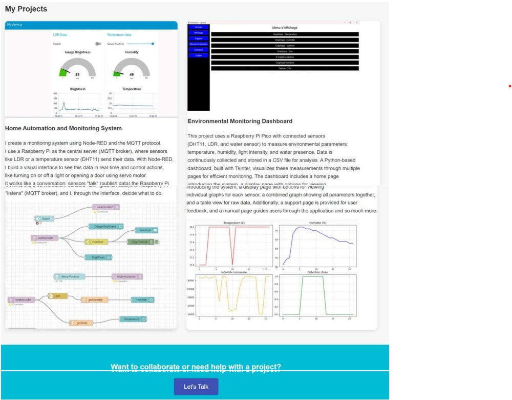

# 🎓 Portfolio DUT Informatique Embarqué 

Portfolio web réalisé pendant mon DUT Informatique Embarqué, présentant une sélection de mes projets en IoT et systèmes embarqués.

## 📌 Contenu du portfolio

- **Portfolio web responsive** (HTML, CSS, JavaScript)
- **Projets IoT et systèmes embarqués** :
  - Système de domotique et surveillance (Node-RED, MQTT, Raspberry Pi)
  - Tableau de bord environnemental (Python, Tkinter, Raspberry Pi Pico)

## 🔧 Technologies utilisées

Ce portfolio web et les projets présentés utilisent les technologies suivantes :

### 🌐 Développement Web
- **HTML5** - Structure des pages
- **CSS3** - Style et mise en page responsive
- **JavaScript** - Interactivité

### 🖥️ IoT & Systèmes Embarqués
- **Raspberry Pi** - Serveur central et broker MQTT
- **Raspberry Pi Pico** - Microcontrôleur pour acquisition de données
- **Node-RED** - Interface de programmation visuelle pour la domotique

### 📡 Protocoles & Communication
- **MQTT** - Communication entre capteurs et serveur
- **HTTP/HTTPS** - Serveur web et communication client-serveur

### 🔌 Capteurs & Matériel
- **DHT11** - Capteur de température et humidité
- **LDR** (Light Dependent Resistor) - Capteur de luminosité
- **Capteur d'eau** - Détection de présence d'eau
- **Servo-moteur** - Contrôle d'actionneurs

### 📊 Gestion de données
- **CSV** - Stockage et export des données des capteurs
- **JSON** - Configuration des flux Node-RED

## 🖼️ Visualisation du Portfolio

### Page d'accueil

*Interface principale avec navigation, présentation et bouton d'exploration*

### Section "À propos"

*Présentation détaillée, compétences et parcours*

### Page Contact

*Formulaire de contact*

### Section Projets

*Cartes interactives présentant les projets de domotique et surveillance environnementale*

